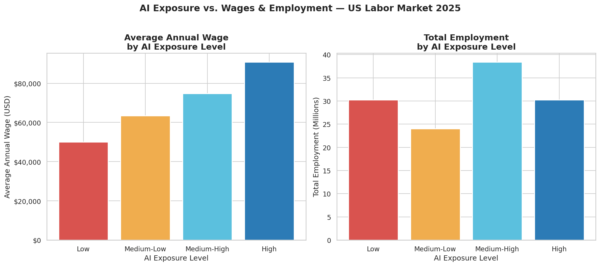
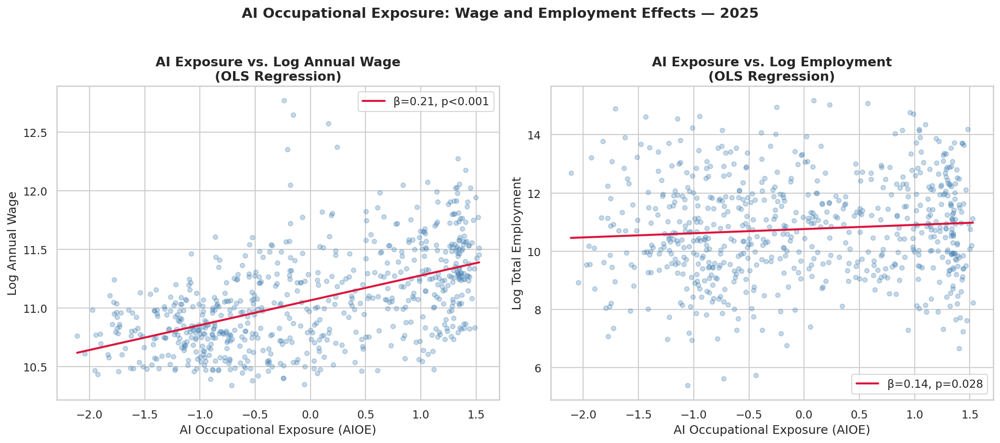

# AI Exposure and Labor Market Outcomes

An empirical analysis of how AI occupational exposure relates to wages 
and employment across the US labor market, using 2025 BLS data and the 
Felten et al. (2021) AIOE index.

Inspired by Acemoglu, Autor, Hazell & Restrepo (2022) — *"Artificial 
Intelligence and Jobs: Evidence from Online Vacancies"*

---

## Research Questions
- Does higher AI exposure correlate with higher wages?
- Does AI exposure predict employment levels across occupations?
- Which occupations are most and least exposed to AI?

---

## Data Sources
- **Felten, Raj & Seamans (2021)** — AI Occupational Exposure (AIOE) 
  index, measuring each occupation's exposure to AI capabilities via 
  O*NET task data. [GitHub](https://github.com/AIOE-Data/AIOE)
- **BLS Occupational Employment & Wage Statistics (OEWS) 2025** — 
  Employment and wage estimates for ~670 occupations nationally.

---

## Key Findings

### 1. AI Exposure vs. Wages & Employment

Higher AI exposure is associated with significantly higher wages — 
occupations in the top quartile earn nearly twice those in the bottom.
Employment distribution shows no simple displacement pattern.

### 2. OLS Regression Results

| Outcome | β (AIOE) | p-value | R² |
|---|---|---|---|
| Log Annual Wage | 0.21 | <0.001 | 0.28 |
| Log Employment | 0.14 | 0.028 | 0.0